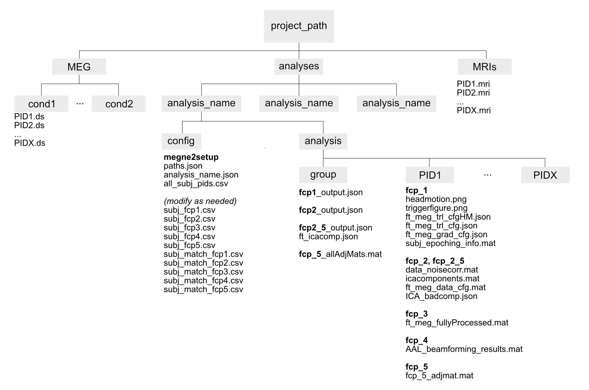
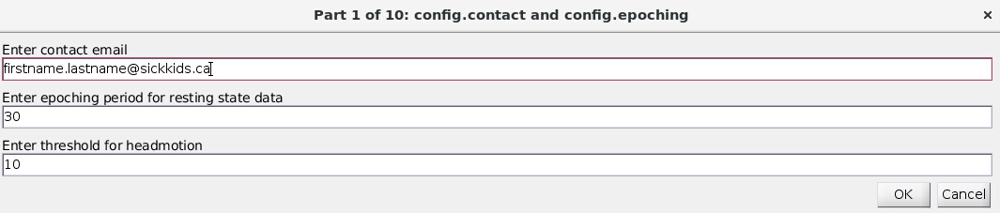
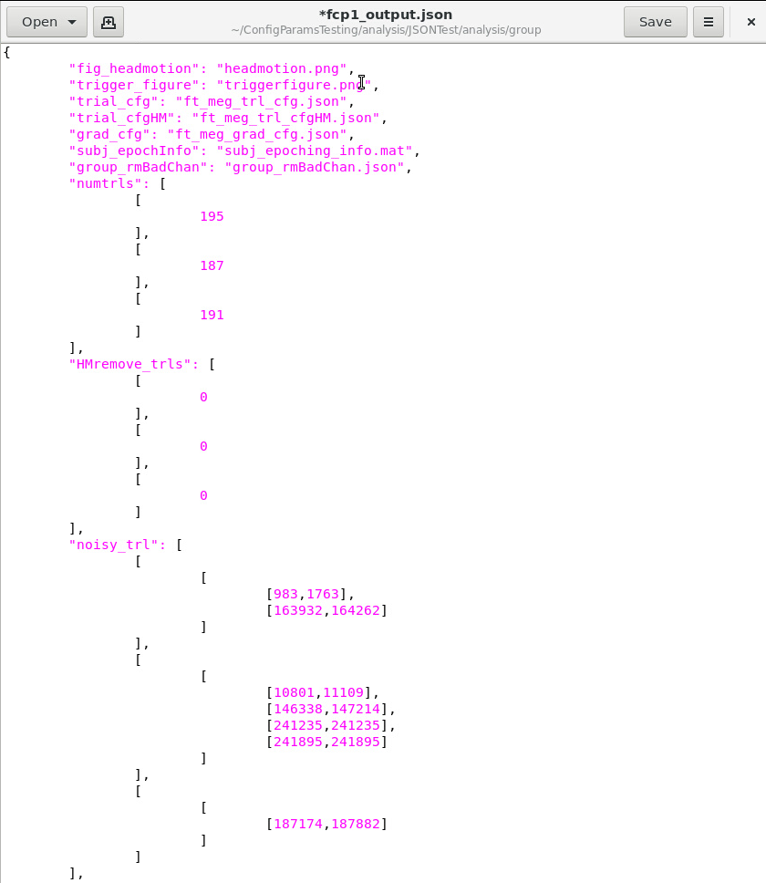
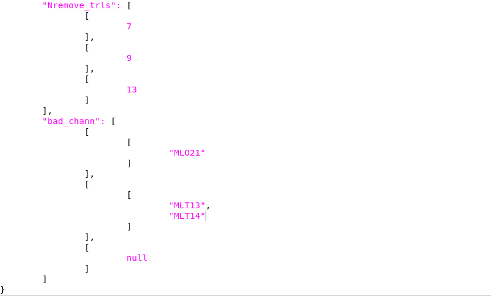
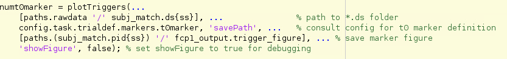
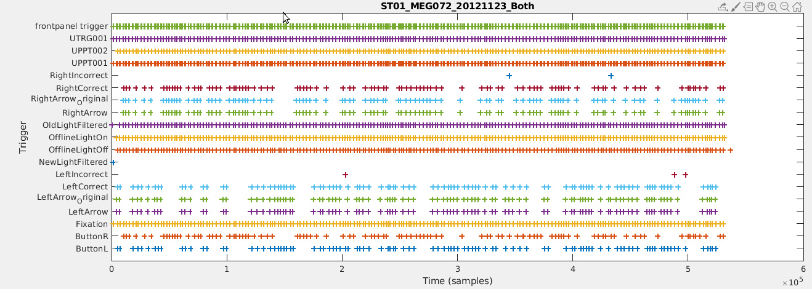
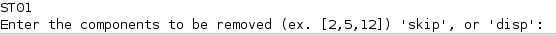

# MEGneto 3.0 

This functional connectivity pipeline (fcp) is built on MATLAB using the FieldTrip toolbox to analyze MEG data. Developed @ SickKids Research Institute, Toronto, Canada. See docs folder for additional documentation.

- [System Requirements](#system-requirements)
- [Installation Guide](#installation-guide)
- [Common Terms](#common-terms)
- [How to Use](#how-to-use)
   1. [Initial Setup](#initial-setup)
   2. [JSON Config Setup](#json-config-setup)
   3. [Epoching](#epoching)
   4. [Preprocessing](#preprocessing)
   5. [ICA Checkpoint](#ica-checkpoint)
   6. [Channel Repair](#channel-repair)
   7. [Beamforming](#beamforming)
   8. [Pipeline Endpoints](#pipeline-endpoints)
      * [Frequency Analysis](#frequency-analysis)
      * [Functional Connectivity](#functional-connectivity)
- [Credits](#credits)
- [On Downsampling](#on-downsampling)
- [Supplementary Reading Material](#supplementary-reading-material)

## System Requirements

* MATLAB
* FieldTrip Toolbox
* Machine with enough RAM

This pipeline is currently being developed with MATLAB R2019a in a Linux environment. Analysis configuration is kept in a JSON file, and can be inspected with any basic text editor. The [FieldTrip toolbox](https://www.fieldtriptoolbox.org/) contains compatibility functions should you need older or newer versions of certain key functions. 

Note that, depending on available RAM on your system, the pipeline may crash during [beamforming](#beamforming) if your MEG data is not adequately downsampled or if you have requested too many virtual sources to be reconstructed (e.g., dipole grid resolution is too high). (See the [On Downsampling](#on-downsampling) section for more on how to handle this.)

## Installation Guide

Download the repo through the Github website or use git in the command line to clone it on your machine. 

## Common Terms

| Term  | Meaning |
| ------------- | ------------- |
| *.ds folder  | Folder containing all MEG-related files for a single participant and single task (if multiple tasks). |
| Fiducial   | Three reference points visible to the MEG that aid in head position localization relative to sensor positions, and positions also used in subsequent MRI for MEG-MRI coregistration in analysis. |
| JSON config file  | A configuration file storing user-specified analysis parameters for various steps of the pipeline. See [this write-up](docs/ConfigParams.md) for an explanation of all necessary parameters. |
| ICA   | Independent component analysis. A computational method for separating a linearly mixed signal into its independent components. |
| Leadfield   | Matrix that describes solution to the [forward problem](https://www.fieldtriptoolbox.org/reference/ft_compute_leadfield/#:~:text=FT_COMPUTE_LEADFIELD%20computes%20a%20forward%20solution,z%2Dorientations%20of%20the%20dipole.) (i.e., how dipole sources contribute to an MEG channel's measured signal). |
| MEG  | Magnetoencephalography |
| MRI  | Magnetic resonance imaging |
| Struct   | In MATLAB, a [struct](https://www.mathworks.com/help/matlab/ref/struct.html) is a data type that stores multiple different data items in a single container. |
| Time window analysis  | A data analysis approach that examines how power at certain frequencies change over consecutive time bins. See FieldTrip tutorial [here](https://www.fieldtriptoolbox.org/tutorial/timefrequencyanalysis/). |

## How to Use

A template "main" function is provided under `templates/main_template.m` which guides the user through the pipeline steps. You should begin by making a copy of this file and renaming it (e.g., main_motor_both if you're running a motor analysis). A unique main file should be created for each of your analyses, as it can serve as a record of what settings you used. 

Also, please note the following naming convention tipes:
A few important notes to remember before running the pipeline are:
1. The functions associated with the steps laid out below are found in the top-level MEGneto folder. Any related functions listed below are found in subfolders of the repo (e.g., the `functions` folder). Anything under development is, accordingly, under `dev_functions`. 
2. The naming convention of your MRI files (which must have a .mri extension) is as follows. These file names should not have more than one underscore or period (i.e., the only period should be the file's extension `.mri`). If there is an underscore, the typical naming convention is `PID_version.mri`. 
3. Participant IDs follow the structure of study name prepended to participant number. For example, OIRM01 would mean that OIRM is the study name and 01 is the first participant. Other examples (for different studies) include ST05 and MEG04 - you may choose the study name to be what you wish. 
4. The pipeline can only process one task at a time. If multiple tasks are fed in, there will be one set of .ds files for participants for task 1 and one for task 2, meaning there will be multiple .ds files for one participant. The pipeline is not equipped to handle this. If you have multiple tasks you wish to analyze, please do one at a time.
5. For an overview of MEGNETO's folder structure please refer to the image below.

### Initial Setup

After making a copy of the main template and renaming it, open it and:
* Fill in the relevant folder paths and analysis name (lines 16-21)
* Add the MEGneto and FieldTrip folders to the path, so MATLAB can find those functions (lines 25-27)
* Assuming this is your first run, skip the paths variable reloading at line 32
* Proceed to the section labelled "%%  fcp_0: setup (megne2setup)"

`MEGNE2SETUP.m` will create the folder structure for your analysis (e.g., config and analysis folders), and create empty setup files in the config directory (e.g., an empty config file to be filled in with analysis parameters, empty CSV files for each pipeline step that you will use to indicate which participants to analyze). If you already have a config file with your preferred parameters, replace the empty config file with that one. 

Note that this step will fail if your MEG and MRI data are not setup properly, namely:
* The `rawdata_path` string should be the path to the folder that contains all *.ds folders for all participants
* The `mri_path` string should be the path to the folder that contains all MRI files with the naming convention [PID].mri

Output: Struct called `paths` with all filepath definitions.

See also: 
- `path_generation.m` to generate path locations
- `path_check.m` to check that all paths are properly initialized

### JSON Config Setup
Prior to running the first step of the pipeline, the user must ensure that the JSON config file is populated with their desired parameters. `interactive_JSON_config.m` will prompt users to fill this JSON config file through an interactive graphical user interface (GUI). There are 10 total GUI pop ups that resemble that of the image below. The user is repsonsible for filling in each field and sample inputs are presented to the user to demonstrate each field's format (note: the user can leave the sample input as is, if they wish to use that value for their analysis).

For more detail on the meaning of each parameter in the JSON Config please see the [Config Params doc](https://github.com/MabbottLab/MEGneto/blob/master/ConfigParams.md).

### Epoching

`FCP_1_TASKEPOCHING.m` will epoch MEG data into trials depending on the desired marker, detect trials with excessive head motion, muscle/jump artifacts, and bad channels. However, the epoching only rejects trials for excessive head motion and muscle/jump artifacts. Bad channels are detected and recorded, but repaired later on in the pipeline, after the ICA process at the final stage of preprocessing.

Note: if there are participants who do not have a matching MRI file, this step will not run until you: a) find the missing MRI and put it in the MRI folder, or b) remove their entry from the `subj_fcp1.csv`. 

Output: A struct with output file names, and for each subject: the number of trials per subject, trials marked with head motion, trials marked with noise, number of removed trials, names of bad channels 

Notes:
- Ensure that subj_fcp1.csv is populated with the subject IDs of included participants.
- Prior to running this step, all desired parameters should be defined in the JSON config file. The user should double-check that the JSON config file is populated appropriately, especially if a template JSON was copied over. Information on the meaning of each parameter in the JSON config file can be found in the [Config Params Guide](https://github.com/dunjamatic/MEGneto/blob/configParams/ConfigParams.md).

- At the beginning of this step, a logging file for progress tracking is set up and matching MEG/MRI data is identified.
- If the user wishes to browse the output of plot_triggers function (a plot), they must indicate “true” for ‘ShowFigure’ when the plot_triggers function is called. By default, this is set to ‘“false”. See the code snippet from fcp_1_taskepoching below for reference.

See also: 
- `ds_pid_match` to get the PIDs where there is matching MEG and MRI data
- `load_participants` to load participants and get *.ds files
- `write_match_if_not_empty` to write down the matching meg/mri data if they exist
- `check_csv_has_empty` to check for empty values in the pid matches table
- `plot_triggers` to plot trigger events that are present in the data over time

- `ft_read_event`  to generate an event list and isolare unique events
- `ft_read_header` to read out information present in the header of the data 
- `ft_definetrial` to epoch the data into trials
- `headmotiontool` to display head movement information and remove bad trials 
- `ft_rejectartifact` to remove channels with artifacts
- `ft_artifact_muscle` to detect and clean artifacts due to muscle movements
- `ft_artifact_jump` to detect and clean jump artifacts
- `detectbadchannels` to detect channels that contain poor data
- `ft_preprocessing` to preprocess data

### Preprocessing

`FCP_2_PREPROCESSINGICA.m` will prepare epoched data for ICA preprocessing by downsampling and filtering with 3rd order gradients (derived from measurements taken by gradiometers). If indicated in the config JSON file, ICA will be carried out and the ICA components will be saved. The pipeline will downsample to whatever frequency the user specified in the config JSON.

Output: A struct with file names for the configuration of the preprocessed data, the data noise correlation matrix, and the ICA components.

Notes:
- Prior to running the function, ensure that `subj_fcp2.csv` is populated with the subject IDs of participants you want to include after checking over initial results.
- Outputs from fcp_1 will be loaded in at the start of this step. Additionally, a logging file will be set up to keep track of progress and the pipeline will check for matching MEG/MRI data. 
- Check participants who had excessive head motion or excessive numbers of bad channels.
- Need to remove bad channels from ica - if not you will get complex numbers. Because during repair channels procedure bad channels are repaired according to neighbours, thus the new ones are not unique (no independent components).

See also: 
- `ds_pid_match` to get the PIDs where there is matching MEG and MRI data
- `write_match_if_not_empty` to write down the matching MEG/MRI data if they exist
- `ft_denoise_synthetic` to compute third order gradients for gradiometer definition and denoise data.
- `ft_resamepledata` to resample the data to a user specified sampling rate. 
- `ft_selectdata` to select data portions of the data
- `ft_componentanalysis` to perform independent component analysis 

### ICA Checkpoint

`FCP_2_5_CHECKPOINT.m` is an interactive session that guides the user through inspection of ICA components to identify components associated with artifacts such as heartbeats, blinks, etc. After inspection, the pipeline backprojects ICA components to remove the signal corresponding with the bad ICA components. For help on identifying components containing artifacts, see [ICA Inspection Guide](https://github.com/MabbottLab/MEGneto/blob/master/docs/ICA%20Inspection%20Guide%20v1.0.pdf).

Output: A struct with file names for the configuration of the preprocessed data, the data noise correlation matrix, and the ICA components and the bad components specified by the user. 

Notes:
- Prior to running the function, ensure that subj_fcp2_5.csv is populated with the subject IDs of participants you want to include.

See also: 
- `ds_pid_match` to get the PIDs where there is matching MEG and MRI data
- `write_match_if_not_empty` to write down the matching MEG/MRI data if they exist
- `ft_rejectcomponent` to backproject an ICA decomposition to the channel level after removing component that have artifacts
- `disp_ica_chans.m` (at bottom of script) 
- `ft_databrowser` to visually inspect the data

*Visualization of this step:*
Below is a sample image of the interactive user display for identifying bad ICA component. Users can browse the components using the left and right arrow buttons, zoom in and out horizontally/vertically using the appropriate “+” and “-” buttons, and more. 

After browsing the ICA components and noting which ones are bad, the user should return to the Matlab command prompt where they are asked to enter those components, as seen in the image below. The sample participant ID is thing image, ‘ST01’, represents the participant who is currently being analyzed. This is repeated for all participants. 

### Channel Repair

`FCP_3_CHANNELREPAIR.m` repairs bad channels detected from fcp_1, but we held off on removing until the data had been ICA-cleaned. The channels are repaired by replacing them with some combination of neighbouring channels (default is 'weighted' average, other options include 'average', 'spline', or 'slap').

Output: *.mat file of fully cleaned data (i.e., removed head motion/muscle and jump artifacts, 3rd order gradients, ICA cleaned data, and repaired bad channels). 

Notes:
- Prior to running the function, ensure that subj_fcp3.csv is populated with the subject IDs of participants you want to include.
- Outputs from fcp2 are loaded at the start of this step and a logging file will be set up to keep track of progress. Further, the pipeline will check for matching MEG/MRI data.
- The output data of this step is in the sensor space MEG data (fully processed).

See also: 
- `ds_pid_match` to extract a list of matching PIDs from the MRI files and output a CSV file with each input DS matched to a PID
- `write_match_if_not_empty` writes a list of PIDs with matched MEG/MRI data if the PIDs aren’t empty
- `ft_prepare_neighbours` to find neighbouring channels based on distance
- `ft_channelrepair` to repair bad channels by replacing them with an average of all neighbours 

### Beamforming

`FCP_4_BEAMFORMING.m` maps functional data onto the source model and interpolates to an atlas. Here, be careful about conversions between mm and cm units in MEG and MRI data. A T1 template head model is loaded in (to normalize all participant head models), and is segmented to set the boundaries of which dipoles are actually located in the brain (ie. removes the skull). Once the head model is properly prepared to create the volume conduction model (which specifies how currents are generated by sources in the brain) a source model is prepared. The source model is a 3D grid/cortical sheet that specifies the set of positions of electric dipole currents that are considered in source reconstruction. 

For each participant, their anatomical MRI data is loaded in and fiducials are identified. The MRI data is segmented and prepared as a head model. The participant’s fully processed MEG data is loaded and resampled to the sampling rate specified in the config JSON file. A subject specific source model is prepared using the T1 template model as a control across participants. A leadfield is computed to be used for efficient inverse modelling. 

Finally, beamforming is performed. A covariance matrix is computed to inform us how related sensor signals are to each other, and sensor weights are computed using the gradiometers (sensor position), leadfield and head model. This information is used for beamforming. The participant’s trials are projected through a spatial filter (which transforms data from sensor to source space) and the resulting virtual sources are projected to their dominant orientation. The output at this point is a matrix with the timeseries for each source, trial, and participant. Next, an atlas is loaded into the pipeline and the source data is interpolated onto that atlas. In that interpolation process, all reconstructed sources that fall into regions as parcellated by the atlas are averaged or principal component analysis ([PCA](https://www.mathworks.com/help/stats/pca.html)) is performed and the first principal component is extracted, generating a representative time series for the region. 

Output: A matrix with three dimensions: [number of participants] x [number of trials] x [number of timepoints]. Thus, you can isolate the timeseries for a certain participant and trial etc.

The following source reconstruction algorithms are currently recommended/supported:
- Exact low resolution electromagnetic tomography (eLORETA) source reconstruction (recommended)
- Linear constrained minimum variance (LCMV) beamformer

The following atlases are currently supported:
- MMP 180 region atlas from Glasser et al.'s 2016 multimodal parcellation paper
- AAL 116 region atlas, but truncated to just regions 1-90 to exclude cerebellar regions
- Yeo 7-network parcellation into visual, somatomotor, dorsal and ventral attention, default, limbic, frontoparietal
- Yeo 17-network parcellation
- Brainnetome parcellation (although the number of regions here greatly outranks the rank of the sensors)

Notes:
- Prior to running the function, ensure that subj_fcp4.csv is populated with the subject IDs of participants you want to include.
- At the start of the function, outputs from fcp_3 will be loaded in and a logging file will be set up to keep track of progress. Also, the pipeline will check for matching MEG/MRI data.

See also:
- `ds_pid_match` to extract a list of matching PIDs from the MRI files and output a CSV file with each input DS matched to a PID
- `write_match_if_not_empty` writes a list of PIDs with matched MEG/MRI data if the PIDs aren’t empty
- `ft_read_mri` to import T1 template from spm8
- `ft_volumesegment.m` to segment anatomical MRI into T1 template specs
- `ft_convert_units.m` to convert volumes between mm and cm for CTF type
- `ft_prepare_headmodel.m` to construct a volume conduction model based on geometry of head, takes previous output as input
- `ft_prepare_sourcemodel.m` to create a 3D grid used for source reconstruction
- `ft_resampledata`  to resample or downsample the data
- `ft_prepare_leadfield.m` to compute the lead field matrix
- `ft_timelockanalysis` to compute the covariance matrix
- `ft_sourceanalysis.m` for source reconstruction
- `ft_sourcedescriptives.m` to project to dominant orientation (largest eigenvector)
- `ft_read_atlas.m`
- `ft_sourceinterpolate.m` to interpolate functional data onto anatomical data using prev as input, subject MRI
- `ft_volumelookup.m` to create binary mask; once applied, will isolate desired regions

### Pipeline Endpoints

After beamforming, you now have a set of timeseries for each participant describing brain activity over time within each atlas ROI and for each trial. 

If you have hypotheses about whether some ROI has more or less activity within a certain frequency band, or if you want to look at how power changes across certain frequencies as a result of some stimulus marker, proceed with `fcp_5_freqanalysis` (currently set up to do power-over-time analyses). 

Otherwise, if you have hypotheses about the _functional connectivity_ between ROIs and within certain frequency bands, proceed with `fcp_5_taskconnectivity`. 

#### Frequency Analysis
`FCP_5_FREQANALYSIS.m` uses spectral analysis on time-frequency representations of data to test hypotheses based on spectral power. The virtual sensor data from the beamforming step is loaded in and frequency analysis is performed on sliding timewindows of the data. Thus, for each subject and each interpolated atlas region, a power spectrum is calculated and corrected to a baseline to control for general/random spikes in power. 

Output: A 4-D matrix containing power spectrum data. Matrix dimensions are [participants] x [regions] x [frequency] x [time]. Users can plot a power spectrum (frequency by time) for a specific region of a given participant’s data by plotting a slice of the matrix's first (participant) dimension (e.g., `imagesc(squeeze(powspctrm(participant_number, :, :, :)))`. 

Notes:
- Prior to running the function, ensure that subj_fcp5.csv is populated with the subject IDs of participants you want to include.
- At the start of this step, outputs from fcp_4 will be loaded in and a logging file will be set up to keep track of progress. Also, the pipeline will check for matching MEG/MRI data.

See also: `ft_freqanalysis.m`

#### Functional Connectivity

`FCP_5_TASKCONNECTIVITY.m` estimates functional connectivity (i.e., analyzes the synchrony of signals from two regions). At the start of this step, outputs from fcp_4 will be loaded in and a logging file will be set up to keep track of progress. Also, the pipeline will check for matching MEG/MRI data.

Currently supports the following connectivity metrics (relevant FieldTrip documentation [here](https://www.fieldtriptoolbox.org/reference/ft_connectivityanalysis/):
- 'plv' (phase locking value)
- 'pli' (phase lag index)
- 'wpli' (weighted phase lag index)
- 'wpli_debiased' (as above, but debiased)
- 'coh' (coherence) The strings listed above should be specified in the config JSON file exactly as presented.

Output: A connectivity matrix for all participants containing region by region by participant by frequency band.

See also: 
- `ft_freqanalysis.m` to perform time-frequency and frequency analysis on the time series data 
- `ft_connectivityanalysis.m` to calculate connectivity between channels
- `ft_checkdata.m` to check the input data of the main FieldTrip functions 

## Credits

**This list is incomplete!**

- Pre-2016: Marc Lalancette
- March 2016: Simeon Wong, Anne Keller
- November 2016: Sonya Bells
- June 2019: Ming Scott
- October 2019: Julie Tseng 
- December 2020: Dunja Matic

## On Downsampling

You may run out of RAM during the beamforming step if your MEG data is not adequately downsampled. MEG data is typically gathered at 1200Hz or 600Hz. However, based on the [Nyquist-Shannon sampling theorem](https://en.wikipedia.org/wiki/Nyquist%E2%80%93Shannon_sampling_theorem), you can downsample to 2x the max frequency you want to recover. But what does that mean in practice?

Assume that the max frequency you want to analyze is 100Hz (e.g., the upper limit of the high gamma frequency band). Then, the Nyquist-Shannon theorem suggests that your data needs to be sampled at 100 x 2 = 200Hz to recover information properly from that 100Hz frequency. 

Based on this, you may choose to downsample your data from 1200Hz to 300Hz. For a 4-second epoch (e.g., -2s to +2s around a marker of interest), this means going from 4800 timepoints to 1200 timepoints for each of the *151* channels. That's 724,800 points to 181,200 - almost 600k less timepoints to crunch with no information loss. Way easier on the machine. 

## Supplementary Reading Material

We've compiled here pertinent papers to read on the topic of MEG processing and functional connectivity metrics:

### On MEG beamforming/source reconstruction
- Tait, L., Ozkan, A., Szul, M. J., & Zhang, J. (2020). Cortical source imaging of resting-state MEG with a high resolution atlas: An evaluation of methods. bioRxiv.

### On atlases
- Rolls, E. T., Huang, C. C., Lin, C. P., Feng, J., & Joliot, M. (2020). Automated anatomical labelling atlas 3. NeuroImage, 206, 116189.
- Thomas Yeo, B. T., Krienen, F. M., Sepulcre, J., Sabuncu, M. R., Lashkari, D., Hollinshead, M., ... & Fischl, B. (2011). The organization of the human cerebral cortex estimated by intrinsic functional connectivity. Journal of neurophysiology, 106(3), 1125-1165.
- Fan, L., Li, H., Zhuo, J., Zhang, Y., Wang, J., Chen, L., ... & Fox, P. T. (2016). The human brainnetome atlas: a new brain atlas based on connectional architecture. Cerebral cortex, 26(8), 3508-3526.

### MEG papers from the Mabbott Lab
- Gauvreau, S., Lefebvre, J., Bells, S., Laughlin, S., Bouffet, E., & Mabbott, D. J. (2019). Disrupted network connectivity in pediatric brain tumor survivors is a signature of injury. Journal of Comparative Neurology, 527(17), 2896-2909.

### On functional connectivity metrics
- Vinck, M., Oostenveld, R., Van Wingerden, M., Battaglia, F., & Pennartz, C. M. (2011). An improved index of phase-synchronization for electrophysiological data in the presence of volume-conduction, noise and sample-size bias. Neuroimage, 55(4), 1548-1565.
- Colclough, G. L., Woolrich, M. W., Tewarie, P. K., Brookes, M. J., Quinn, A. J., & Smith, S. M. (2016). How reliable are MEG resting-state connectivity metrics?. Neuroimage, 138, 284-293.
