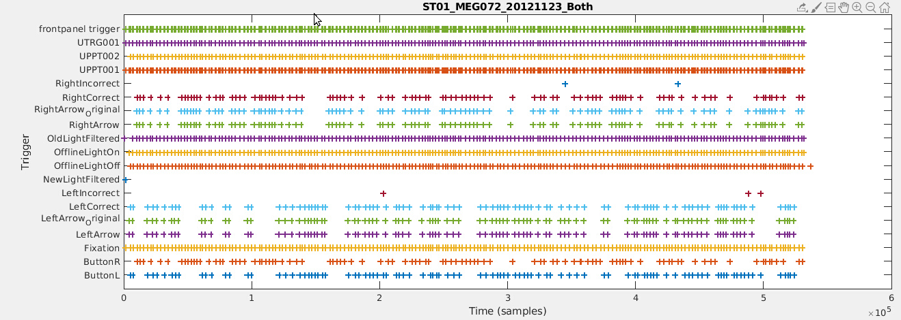

# MEGneto 3.0 

This MEG analysis pipeline is built on MATLAB using the FieldTrip toolbox to analyze MEG data. Developed @ SickKids Research Institute, Toronto, Canada. See docs folder for additional documentation.

- [Credits](#credits)
- [System Requirements](#system-requirements)
- [Installation Guide](#installation-guide)
- [How to Use](#how-to-use)
   1. [Initial Setup](#initial-setup)
   2. [Epoching](#epoching)
   3. [Artifact Rejection and Channel Repair](#artifact-rejection-with-ICA-and-channel-repair)
   4. [Beamforming and Atlas Interpolation](#beamforming)
        * [Marking Fiducial Points on T1](#prep_T1)
        * [Actual Beamforming](#actual-beamforming)
   5. [Pipeline Endpoints](#pipeline-endpoints)
      * [Frequency Analysis](#Step4a-frequency-analysis)
      * [Functional Connectivity (Static)](#Step4b-static-functional-connectivity)
      * [Functional Connectivity (Dynamic)](#Step4c-dynamic-functional-connectivity)
      * [Cross-Frequency Coupling](#step4d-cross-frequency-coupling)
- [Supplementary Reading Material](#supplementary-reading-material)

## Credits

Many individuals have contributed to this pipeline, including before its initial upload to Github:

- Sam Doesburg
- Sonya Bells
- Simeon Wong
- Diana Markova
- Ming Scott
- Julie Tseng 
- Dunja Matic
- Bianca Ha

## System Requirements

* MATLAB
* FieldTrip Toolbox
* Machine with enough RAM (depending on beamforming processing parameters)

This pipeline was developed with MATLAB R2019a in a Linux environment. The [FieldTrip toolbox](https://www.fieldtriptoolbox.org/) contains compatibility functions should you need older or newer versions of certain key functions. 

## Installation Guide

Download the repo through the Github website or use git in the command line to clone it on your machine. In MATLAB, use `addpath(genpath('/path/to/megneto'))` to add the functions to your path. This can also be included at the top of your `main_xyz.m` file, which is used as a master script to document your specific analysis (see the `main_template.m` file in the templates folder of this repo).  

## How to Use

A template "main" function is provided under `templates/main_template.m` which guides the user through the pipeline steps. You should begin by making a copy of this file and renaming it (e.g., main_motor_both if you're running a motor analysis). A unique main file should be created for each of your analyses, as it can serve as a record of what settings you used. 

Folder structure within your analysis folder will look as follows:
```
study/derivatives/project_path/
    > main_analysis.m (file with your pipeline parameters)
    > analysis_name
        > participant_1
            > output files from pipeline
        > participant_2
    > config
        > participants_list.csv (participant IDs to be analyzed)
```

### Initial Setup

After making a copy of the main template and renaming it, open it and:
* Fill in the relevant folder paths and analysis name (lines 15-26)
* Add the MEGneto and FieldTrip folders to the path, so MATLAB can find those functions (lines 30-32)
* Follow the "FIRST TIME SETUP ONLY" section to generate a list of participant IDs based on data folder
* Continue on to configure analysis options for each pipeline step (lines 57-179)

### Epoching

`Step1_Epoching.m` will epoch MEG data into trials, detect trials with excessive head motion, muscle/jump artifacts, and bad channels. However, the epoching only rejects trials for excessive head motion and muscle/jump artifacts. Bad channels are detected and recorded, but repaired later on in the pipeline, after the ICA process at the final stage of preprocessing.

Output: 
* `step1_data_clean.mat`: cleaned, epoched data
* `out_struct.mat`: MATLAB struct with some bookkeeping info about the step
* `plot_markers.png`: image of markers plotted along the timeseries
* `headmotion_[date].png`: head motion plot across timeseries

See also: 
- `plot_triggers` to plot trigger events that are present in the data over time

- `ft_read_event`  to generate an event list and isolare unique events
- `ft_read_header` to read out information present in the header of the data 
- `ft_definetrial` to epoch the data into trials
- `headmotiontool` to display head movement information and remove bad trials 
- `ft_rejectartifact` to remove channels with artifacts
- `ft_artifact_muscle` to detect and clean artifacts due to muscle movements
- `ft_artifact_jump` to detect and clean jump artifacts
- `detectbadchannels` to detect channels that contain poor data
- `ft_preprocessing` to preprocess data

### Artifact rejection with ICA and Channel Repair

`Step2_ICA.m` handles the ICA processing, component checking, eventual rejection, and channel repair for the pipeline. You can indicate which phase of ICA (ICA, component checking, or component backprojection) you would like to carry out using the 3rd input argument to the function.
When using the ICA checking step, an interactive window will pop up that allows you to scrub through ICA components by trial. 

See also the guide under "docs/ICA_Inspection_Guide_v2.0.pdf" for visual examples of artifacts. 

Output: 
* `step2_data_fullyProcessed.mat`: cleaned, epoched, ICA component rejected data
* `step2_icaComponents.mat`: output of running ICA on the step1 data
* `step2_badComp.csv`: list of components to be rejected

Notes:
- Check participants who had excessive head motion or excessive numbers of bad channels and exclude them from further steps if needed.
- Need to remove bad channels from ica - if not you will get complex numbers. Because during repair channels procedure bad channels are repaired according to neighbours, thus the new ones are not unique (no independent components).

See also: 
- `ft_denoise_synthetic` to compute third order gradients for gradiometer definition and denoise data.
- `ft_resampledata` to resample the data to a user specified sampling rate. 
- `ft_selectdata` to select data portions of the data
- `ft_componentanalysis` to perform independent component analysis 
- `ft_rejectcomponent` to backproject an ICA decomposition to the channel level after removing component that have artifacts
- `disp_ica_chans.m` (at bottom of script) 
- `ft_databrowser` to visually inspect the data
- `ft_prepareneighbours` for channel repair

### Beamforming

#### Prep_T1

Prior to beamforming, a T1 must be marked with the fiducial marker locations for use in beamforming. Use the `Prep_T1.m` script to do this. 
As the same marked T1 can be used for any of the MEG analyses, this process only needs to be completed once. 
There's no need to complete this step if it has already been done by someone else. 
As this output can be reused, it should be stored in its own derivatives folder rather than nested within your MEG analysis folder. 

See FieldTrip's [documentation on `ft_volumerealign` for more details](https://www.fieldtriptoolbox.org/faq/how_to_coregister_an_anatomical_mri_with_the_gradiometer_or_electrode_positions/). 

#### Actual beamforming

`Step3_Beamforming.m` maps functional data onto the source model and interpolates to an atlas. 

Broadly, steps include:
1. Template grid (sourcemodel) from FieldTrip is loaded in with preselected dipole grid resolution, in MNI position space
2. Participant model is created using the aligned T1 (output of Prep_T1) to create a brain segmentation for use in modelling
3. Image saved to file depicting alignment between head, source, and sensors
4. Atlas is loaded in and dipole grid is interpolated to atlas, thereby assigning to each dipole/source an atlas label. Based on user input, only dipoles within relevant ROIs are source reconstructed to save on compute resources
5. Beamforming occurs with all sensor weight calculations. 
6. Dipoles all belonging to particular ROIs are combined into representative timeseries for that ROI, then saved.

LCMV is a common beamformer used, but any fieldtrip beamforming algorithms are available. 

Output:
* `step3_data_roi.mat`: cleaned, epoched, source reconstructed data by ROI
* `step3_source_head_sens_align.png`: image showing alignment between source model, MEG sensors, and head model

See also:
- `ft_read_mri` to import T1 template from spm8
- `ft_volumesegment.m` to segment anatomical MRI into T1 template specs
- `ft_convert_units.m` to convert volumes between mm and cm for CTF type
- `ft_prepare_headmodel.m` to construct a volume conduction model based on geometry of head, takes previous output as input
- `ft_prepare_sourcemodel.m` to create a 3D grid used for source reconstruction
- `ft_resampledata`  to resample or downsample the data
- `ft_prepare_leadfield.m` to compute the lead field matrix
- `ft_timelockanalysis` to compute the covariance matrix
- `ft_sourceanalysis.m` for source reconstruction
- `ft_sourcedescriptives.m` to project to dominant orientation (largest eigenvector)
- `ft_read_atlas.m`
- `ft_sourceinterpolate.m` to interpolate functional data onto anatomical data using prev as input, subject MRI
- `ft_volumelookup.m` to create binary mask; once applied, will isolate desired regions

### Pipeline Endpoints

After beamforming, you now have a set of timeseries for each participant describing brain activity over time within each atlas ROI and for each trial. 

#### Step4a: Frequency Analysis
`Step4a_FrequencyAnalysis.m` uses spectral analysis on time-frequency representations of data to test hypotheses based on spectral power. The virtual sensor data from the beamforming step is loaded in and frequency analysis is performed on sliding timewindows of the data. Thus, for each subject and each interpolated atlas region, a power spectrum is calculated and corrected to a baseline to control for general/random spikes in power. 
This can be configured to be an overall power analysis, or a TFR (sliding time window) power analysis. 

Output: 
* `step4a_freq_overallpower.mat`: No sliding timewindow power analysis
* `step4a_freq_tfr.mat`: Power analysis with sliding window

See also: `ft_freqanalysis.m`

#### Step4b: Static Functional Connectivity

`Step4b_Connectivity.m` estimates functional connectivity (i.e., analyzes the synchrony of signals from two regions).
You can use any of the metrics listed in FieldTrip's `ft_connectivityanalysis` function, but our recommendation is wpli_debiased. 

Output: 
* `step4b_conn.mat`: connectivity matrices in the *.conn_method field with the dimensions condition x roi x roi x frequency_band. 

See also: 
- `ft_freqanalysis.m` to perform time-frequency and frequency analysis on the time series data 
- `ft_connectivityanalysis.m` to calculate connectivity between channels
- `ft_checkdata.m` to check the input data of the main FieldTrip functions 

#### Step4c: Dynamic Functional Connectivity

`Step4c_DynamicFC.m` estimates dynamic functional connectivity (i.e., analyzes the synchrony of signals from two regions with a sliding window across time).
You can use any of the metrics listed in FieldTrip's `ft_connectivityanalysis` function, but our recommendation is wpli_debiased. 

Output: 
* `step4b_connDFC.mat`: connectivity matrices in the *.conn_method field with the dimensions timewindow x roi x roi x frequency_band. 

See also: 
- `ft_freqanalysis.m` to perform time-frequency and frequency analysis on the time series data 
- `ft_connectivityanalysis.m` to calculate connectivity between channels
- `ft_checkdata.m` to check the input data of the main FieldTrip functions 

#### Step4d: Cross Frequency Coupling

`Step4d_CFC.m` is a cross-frequency coupling function that calculates the mean vector length (a phase-amplitude coupling measure) between regions.

Output: 
* `step4d_CFC_lowfreq_highfreq.mat`: MATLAB struct containing data, where CFC values are organized as chanlow x chanhigh

## Supplementary Reading Material

We've compiled here pertinent papers to read on the topic of MEG processing and functional connectivity metrics:

### On MEG beamforming/source reconstruction
- Tait, L., Ozkan, A., Szul, M. J., & Zhang, J. (2020). Cortical source imaging of resting-state MEG with a high resolution atlas: An evaluation of methods. bioRxiv.

### On atlases
- Rolls, E. T., Huang, C. C., Lin, C. P., Feng, J., & Joliot, M. (2020). Automated anatomical labelling atlas 3. NeuroImage, 206, 116189.
- Thomas Yeo, B. T., Krienen, F. M., Sepulcre, J., Sabuncu, M. R., Lashkari, D., Hollinshead, M., ... & Fischl, B. (2011). The organization of the human cerebral cortex estimated by intrinsic functional connectivity. Journal of neurophysiology, 106(3), 1125-1165.
- Fan, L., Li, H., Zhuo, J., Zhang, Y., Wang, J., Chen, L., ... & Fox, P. T. (2016). The human brainnetome atlas: a new brain atlas based on connectional architecture. Cerebral cortex, 26(8), 3508-3526.

### MEG papers from the Mabbott Lab
- Gauvreau, S., Lefebvre, J., Bells, S., Laughlin, S., Bouffet, E., & Mabbott, D. J. (2019). Disrupted network connectivity in pediatric brain tumor survivors is a signature of injury. Journal of Comparative Neurology, 527(17), 2896-2909.

### On functional connectivity metrics
- Vinck, M., Oostenveld, R., Van Wingerden, M., Battaglia, F., & Pennartz, C. M. (2011). An improved index of phase-synchronization for electrophysiological data in the presence of volume-conduction, noise and sample-size bias. Neuroimage, 55(4), 1548-1565.
- Colclough, G. L., Woolrich, M. W., Tewarie, P. K., Brookes, M. J., Quinn, A. J., & Smith, S. M. (2016). How reliable are MEG resting-state connectivity metrics?. Neuroimage, 138, 284-293.
